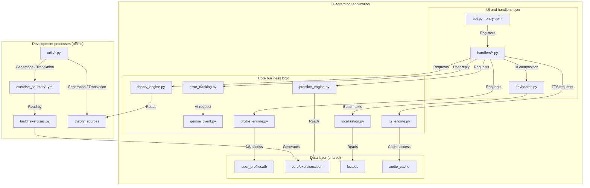

# ENG‑Coach — AI tutor in Telegram

ENG-Coach is an AI-powered English tutor in Telegram. Translate short prompts, get human-like feedback with on-demand grammar theory, and listen to reference audio (TTS).  
Supports 18 languages and A1–B2 levels with a multilingual UI.  
Built solo in ~3 months (AI-assisted) with tests and a clean architecture. Suitable for EdTech pilots and personal use.

**Status:** MVP (public demo). Active development; API/UX may change.  
**Try the demo:** [@YourEnglishAICoachBot](https://t.me/YourEnglishAICoachBot)  
**Contact for pilots:** [aiengcoach@gmail.com](mailto:aiengcoach@gmail.com)

---

## TL;DR

Translate → get AI feedback, theory, and TTS  
18 languages · Levels A1–B2 · Two modes: **Live feedback** & **Analysis + Theory**   
Built with Python + OpenAI + Telegram + gTTS + SQLite

A smart English trainer in Telegram with clear error explanations, contextual grammar theory, and reference audio — all in one dialogue.  
Fast learning loop: do → make a mistake → understand → fix → reinforce.

---

## How it works
### Step-by-step: Try it in 30 seconds
1. Press **Start** in the bot.
2. Choose the explanation language, your level (A1–B2), and mode. There are two modes:
   **Live feedback** — a human-like explanation in natural language; **Analysis + Theory** — structured analysis with error topics, a **Second chance**, and **Theory** / **Detailed analysis** buttons.
3. The bot will send a phrase in the selected language to translate into English. Task language and explanation language can differ, so you can practice translation while receiving tips in your native language.
4. Send your answer.
5. If the answer is correct — great! Tap **Listen** to hear the reference pronunciation and move on to the next task.
6. If there’s a mistake:
   * In **Analysis + Theory**, the bot shows the error topics, gives a **Second chance**, and provides **Theory** and **Detailed analysis** buttons.
   * In **Live feedback**, you get a human-like explanation in natural language.
7. After the analysis or correction, proceed to the next task.

### Video demos
- Correct answer → TTS: [watch](https://github.com/user-attachments/assets/55180dcb-49b5-4309-9084-bb7cb7f1d309)
- Second chance (hint → retry): [watch](https://github.com/user-attachments/assets/40c266a1-0ea6-4f2b-a815-a591442edc34) 
- Multiple errors (RU): [watch](https://github.com/user-attachments/assets/62f2b85b-ef1e-4590-b145-aa84f0e55c20)
- Multilingual UI: [watch](https://github.com/user-attachments/assets/50ff4d49-a19c-4bcd-ad43-6960c9094481) 

### Feature highlights with screenshots

<table>
  <tr>
    <td>
      
      
Error analysis + second chance

    </td>
    <td>
      
      
Reference audio (TTS)

    </td>
  </tr>
  <tr>
    <td>
      
      
Multilingual UI

    </td>
    <td>
      
      
Theory — Present Simple

    </td>
  </tr>
</table>

**Why it’s different**
- Error → Theory → Reference audio in one flow (less context switching)
- Flexible analysis — not tied to one phrasing; accepts valid paraphrases

---

## What’s implemented

- Dialog practice: prompts, mistakes, explanations
- Flexible analysis — not tied to a single “correct” answer (accepts valid paraphrases)
- “Second chance” system: gentle hint with retry option
- AI explanations: “Classic” (plain) and “Technical” (structured)
- Theory on demand — right below the specific error
- TTS for correct variants (yours or corrected)
- Levels A1–B2; multilingual UI
- Inappropriate/toxic message filter

---

## Roadmap
- Full‑fledged tutor personas tailored to specific language groups
- “Quest” mode with narrative voice‑over (story + test): live episodes, branching answers, inline explanations, a final mini‑test per chapter
- Characters that persist across modes
- Audio skills: “Audio dictation” (listen → type)
- Peer practice & co-op quests: 1-on-1 auto-match by level, timed rooms, simple moderation
- Progress: personal stats and difficulty adaptation; task selection based on error history
- Cross‑platform expansion: native iOS/Android apps and a web client; feature parity with Telegram, synced progress and settings
- Shared API layer: expose core as HTTP API; account linking (Telegram ↔ email), push notifications; privacy/export controls

---

## Who it’s for
- Self‑learners and busy people — short daily practice
- Anyone who needs understandable feedback, not just a “verdict”
- Teachers — as a supplementary practice tool or homework trainer

---

## Architecture

---

## Quality approach
Quality and stability are key priorities. A multi‑layer automated testing setup includes:
- **Unit tests:** validate each module in isolation (from TTS engine to the profile system)
- **Integration tests:** ensure correct interaction of core components
- **E2E tests:** emulate full user scenarios (answer → error analysis → theory request)
- **Data completeness tests:** automatically verify the presence of theory and localization files for all topics

---

## Development process
Development happens in an isolated environment (`telegram_test`) to add features without risking real users. The public demo (`telegram_demo`) is updated only after full testing and stabilization, ensuring reliability and quality for end users.

---

## Technologies

**Runtime & concurrency**
- Python 3.11+, asyncio, logging

**Interface**
- python‑telegram‑bot 22.x (ApplicationBuilder, Command/Message/Callback handlers, Reply/Inline keyboards)

**Data**
- SQLite (user_profiles.db) + aiosqlite (async DB access)

**AI & integrations**
- OpenAI SDK, Google Generative AI
- python‑dotenv — load tokens/config from `.env`

**Speech (TTS)**
- gTTS — audio generation
- File cache (name derived from text/mode/level hash, directory `audio_cache/{lang}/{mode}/{hash}.mp3`)

**Configuration & content**
- PyYAML — build exercises from `exercise_sources/*.yml` into `core/exercises.json`
- JSON (localization/taxonomy), Markdown (theory)

**Testing**
- pytest (unit, integration, E2E) + pytest‑asyncio/anyio for async scenarios

---

## What I learned
> No prior IT background; AI used as an engineering assistant.
- How to design and test full user flows in a Telegram environment (from intent → feedback → theory → retry)
- How to use AI (GPT / Gemini) as a co-developer: prompt design, fallback strategies, and response parsing
- How to structure NLP-based bots with strong test coverage (unit, integration, E2E)
- How to optimize UX around language mistakes — blending structure and empathy

---

## Demo
> Telegram: [@YourEnglishAICoachBot](https://t.me/YourEnglishAICoachBot)

---

## Privacy

This bot does not store any personal data.  
Logs contain only technical metadata (such as message IDs and timestamps) used for debugging and automated testing.  
No messages, translations, or user inputs are saved outside the Telegram runtime.

## Contact
Creator: Eugene Taras  
<a href="mailto:aiengcoach@gmail.com">aiengcoach@gmail.com</a>
